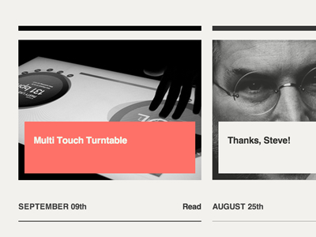
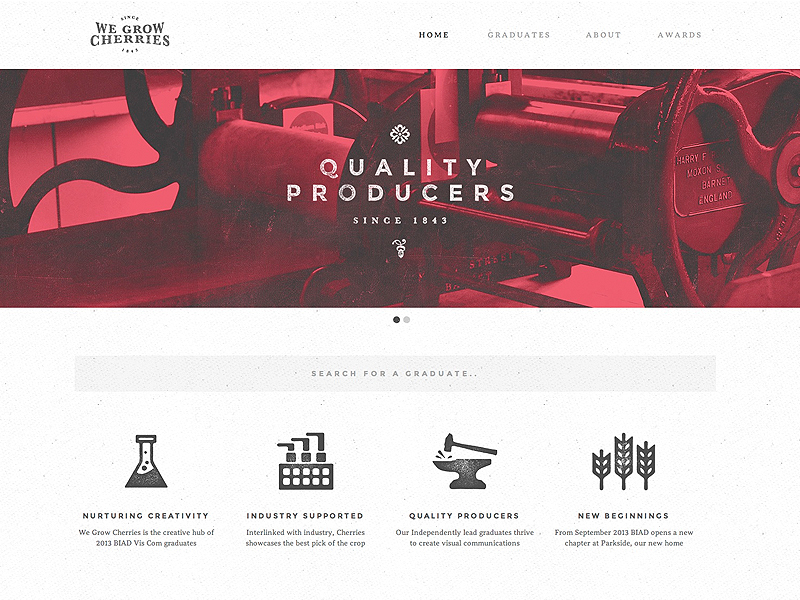
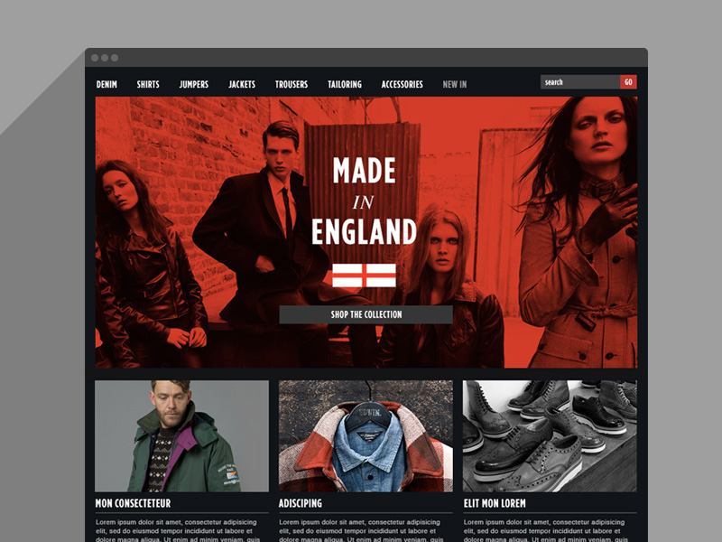
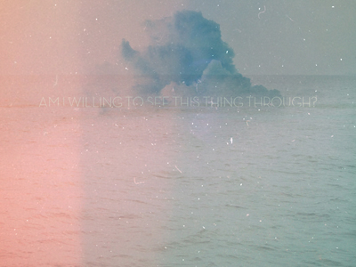
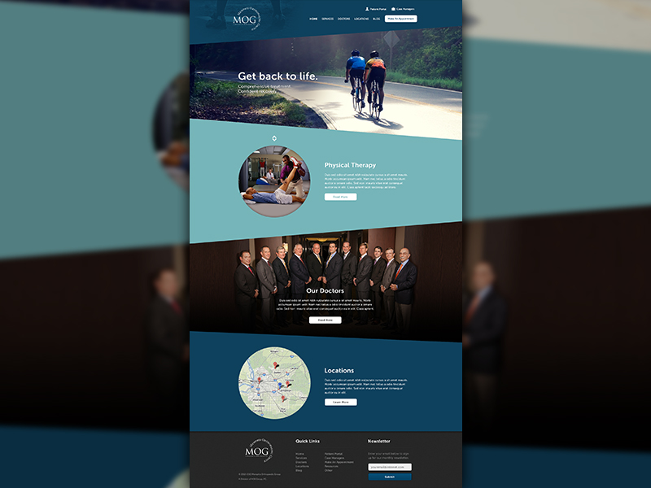
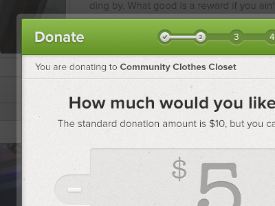

<h1 class="title graphic-methods">Graphic Methods</h1>

These are tried and tested treatments and clichés for graphic elements. The focus here is not on styles or fads but on methods that are more or less "timeless".

Images and text
-------------
* Solid block with text on top of image for a rigid and serious layout

* Type incorporated in photo

* **Dark layer** over a background image to turn it "monochrome" and to allow text on top of it.

* Blurry image in the back. Sharp graphics in the front.

* Duotone for images

* Gradient overlay for images to create depth, harmony (with other elements), unity (if image is too busy etc).

* Fade out parts of images to put focus on certain areas.

* Use blur around details that should be highlighted.

* Free floating images, cut loose from their picture frames.

Textures
-------------
* Overlay semitransparent image of texture.

Colors
-------------
* **Light vs dark** area contrasting.

* Semi-transparent color layer on top of black/white graphics.  

 

* Brand **color stripe** across screen (often on top) to anchor the page.

* Monochrome **vector outlines** on monochrome or gradient elements.

* **Monochrome background** and black and white image on top for focus and to make it look more stylized.

* **White room** for products to create spacious feeling. Fits well with type in the same area.

* **Handmade**, or hand drawn, elements add contrast and life to a layout.

Boxes and layouts
-------------
* **Overlapping elements** can disrupt a too rigid layout.

* Edges

* Borders

* Contrast 2D elements with 3D elements.

* Diagonal lines create movement, action, speed and energy.

Details and effects
-------------
* Semi-transparent borders.

* Cut-through fat type so you see image in the background, through letter.

* Overprint effect for visual disruption and retro look.

Data
-------------
### Line Graphs

Interfaces
-------------
* Interfaces that are not marketing pages.

<h5>References</h5>
<a href="modularscale.com">Modular Scale</a>
<a href="dribbble.com">Dribbble</a>
<a href="http://colorschemedesigner.com/">Color Scheme Designer</a>

