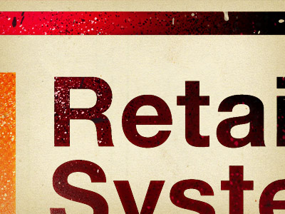
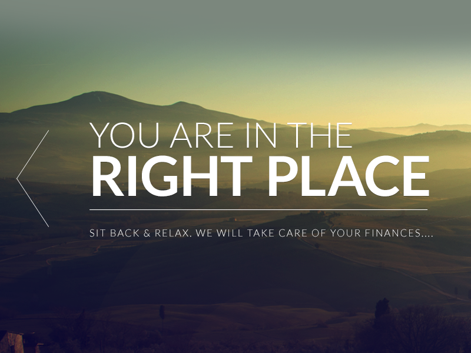

#####Design Process
*An attempt to summarize a design process.*

Project Initiation
=============

*A potential client has a problem they want to solve*

* How will solving this problem help our business?
* Why is our business capable of making this solution a success?
* What are the Unique Selling Points of the client's idea?
* What is the overall goal of the project?
* What are the moral implications of working with the client? Will we be able to sleep at night?
* Who from the client's side will be the one contact person with "the final word" during the project?
* What are the deadlines? Are there any milestones? 

<h5>References</h5>
<a href="http://www.elezea.com/2013/05/one-ux-deliverable/">Unique Selling Points and more</a>

Framing the problem
===================

### Questions for client
#### Marketing Overview
* What types of marketing are you currently involved in or practice on a regular basis?
* Do you have a tag line?
* What is your elevator pitch?
* Do you have a mission statement?

#### Marketing Goals and Objectives
* When it comes to marketing (in general), what are your biggest challenges?
* When it comes to obtaining qualified leads, what are your biggest challenges?
* When it comes to closing leads, what are your biggest challenges?
* Are there any short-term or long-term corporate goals that need to be considered in the website redesign?

#### Product and Service Overview
* How would you briefly define your product or service offering?
* Do certain products and/or services speak to different type of clients?

#### End Users
* Who is the end user? What do they know? How tech savvy are they? Do they use old versions of browsers?
* Can the end users be classified into clear “personas” with varying degrees of needs and selection criteria?
* Which user needs are we trying to address? For existing products, what are the shortcomings we need to fix?
* What are the 3 most important tasks for the end user?
* What customer insights do we have available to inform the solution (customer support, analytics, market research, user research, competitive analysis, etc.)?
* At the end of a project or sale or even website visit, how do you qualify it as a success?

#### Competitive Overview
* List a few competitors that you’d consider benchmark companies?
* What differentiates your company and product from your competitors?
* What about these companies makes then stand apart from others?
* What elements of these companies and/or their online activity would you like to model after in your redesign?

#### Search Overview
* Based on what you know right now, what keywords or phrases would “you” use to search for your products and/or service offering?
* What search terms are your competitors targeting?
* Of the words you just listed, which ones would you like to target with the new website?
* Do you have existing content that can support these keywords or phrases?
* Does your existing website and content rank for these phrases?

#### Website Current State
* What does your website currently do well?
* What does your website currently do poorly?
* Are there any aspects of your website that you love?
* Are there any aspects of your website that you hate?
* Is there anything on the current website that needs to be removed entirely?
* Is there anything on the current website that must absolutely stay?

#### Website Future State
* What is the most important factor of your new website?
* What functional requirements are needed within the new website?
* What visual elements are needed within the new website?
* Are there any brand colors that should be used for the new website?
* What social media elements would you like integrated?
* Do you have a proposed sitemap prepared?
* Do you need a subscription option or other offer?
* Will you be blogging?
* Will you require responsive design (adapts automatically to mobile devices)?
* Is there anything that you would like to have included in the new website that you lack currently?

#### Project Constraints
* What is proposed date for kicking off your web design project?
* What is you desired date for going live?

#### Content to Assemble
* High resolution logo
* Content for pages
* Blog posts
* Literature or brochures
* Sales presentations
* Case studies
* Press releases
* Videos or podcasts
* Images
* Testimonials
* Articles
* Events
* Other marketing collateral

#### Context
* In which context will the service/app be used? How important is responsive design?

### The framing of the problem
* Strip down number of tasks as much as possible to focus on a minimally viable product (MVP) 
* Summarize the task and see if client agrees.
* This product is like "..." but with a "..." Try finding similarities to other products but point to the Unique Selling Point.

<h5>References</h5>
<a href="http://www.web-savvy-marketing.com/2013/03/web-design-projects-50-questions/">50 Questions before a project</a>
<a href="http://alistapart.com/article/usable-yet-useless-why-every-business-needs-product-discovery">Product Discovery</a>
<a href="http://viljamis.com/blog/2012/responsive-workflow/">Responsive Workflow</a>

Research
========

#### Preferable product walkthrough
* Have end users explain how they work to solve the problem at hand.
* Where are they when they use the tool(s)? At home? At work? On the go?

#### Second best product walkthrough
* Have client show the product, step by step how it's used.
* If possible, record the walkthrough on video.

#### Mapping
* What do different areas/parts of the existing design do? E.g. "Provide information", "Allow for entries" etc.
* Where in the system does the user **get information**? Where does the user **enter information**. i/o.
* Are there areas for interacting with settings and general site specific issues?
* How are these things reflected in the current layout?

Journey Maps
===========

*The relationship that unfolds over time between an individual and a system.*

* Grounded in research (interviews, ethnographic observation, contextual inquiry, surveys)
* Good for workshops with clients

#### Contents of a Journey Map
* Original user story: Along the timeline, plot out how the system works today.
* How it could be. Next to original story, plot out ideas for how it could be.
* Questions a user might have at a certain point. “Can I trust this retailer?” or “When will my stuff arrive?”

<h5>References</h5>
<a href="http://uxmag.com/articles/illustrating-the-big-picture">UXMag </a>
<a href="http://www.elezea.com/2013/05/one-ux-deliverable/">Unique Selling Points and more</a>

Fundamental parts of UI
===================

### Information
* Resource: user needs to find something

### Action
* User needs to enter or change something
 

Concept work for UI
========
### Brainstorming
#### Structure and basic rules
* Main purpose is to get as many ideas as possible. Not as good ideas as possible.
* **No criticizing of ideas** during the brainstorm. All ideas are valid no matter how crazy. Criticizing comes later.
* Type out 3 main questions that needs to be answered, e.g. "How can we allow for a good system overview considering we have data X, Y and Z that needs to be in it?". Ask yourself: "What problem do we need so solve?".
* No more than 4-5 people in a brainstorming group.
* Use post-it notes to prevent interrupting each other.
* Use thick markers on post-its so the text/sketches are seen from across the room.

#### During brainstorm
* If stuck on a question, jump to the next.

#### Categorizing after brainstorm session
* Try to see what overall categories have emerged, e.g. "Navigation", "CMS", 
* Cluster redundant or similar notes
* Take photos of post-its at the end of the brainstorm.

### Sketching
* Pen and paper: Diagrams or screenshots. Draw arrows and text showing what things are and which action leads to what.
* Take photos of sketches and email/post them to the team for feedback.
* Miniature wireframe layouts made in graphics program. Stay way from details.

<h5>References</h5>
<a href="http://www.optimalworkshop.com/">Card Sorting Tools and More</a>

Todo Lists
========

*Use a tool like [Trello](http://trello.com) or [Trajectory](https://www.apptrajectory.com) to document stories on cards.*

### Ideas
* State the problem in the title of the card. State who has the problem.
* Post sketches. 
* Get client feedback on the card.

### Tasks
* Mark each story with the type of task it is (for developer? for designer? for client to answer?)
* Prioritize stories. This is an ongoing task for the client to make sure the most important things are implemented first.

### Potential topics/categories for todos
* Ideas
* Discussions
* On Hold
* Up Next
* Done
* Up for review
* Feature Creep (Items added after agreed set of todos)

<h5>References</h5>
<a href="http://trello.com">Trello</a>

Graphic Design
============

### Brand Manuals
* Does the brand/client/product have a brand style manual? How strict does it have to be followed?

### Come up with keywords that fit the product
* Describing the feeling the product should express
* e.g. Strong vs Delicate, Friendly vs Exclusive, Playful vs Serious, Quirky vs Strict, Modern vs Timeless, Simple vs Complex, Clean vs Active/Busy. 
* Take screenshots/photos of other sites/objects/products that express this according to you.
* Always get sign-off from client. Make sure **one** person from the client's side can have the final word to avoid conflicting messages down the road.

### Typography
* Find a typeface for body type that fits the keywords
* Use a tool such as [Modular Scale](modularscale.com) to set sizes of type and elements

### Color swatches
* Select colors that correspond to the keywords
* Use something like [Color Scheme Designer](http://colorschemedesigner.com/)

### Element Collages
* Create [Element Collages](http://danielmall.com/articles/rif-element-collages/) and communicate with clients.
* Show a range of elements rather than a full layout to save time. Client gets a feeling for the look and feel and style, not the details or the ixd. Prevents client from focusing on the wrong things.
* Everything will change so don't believe in there being a "final sketch" in FW/PS.

### Graphic Design Clichés
* Overlay semitransparent image of texture

  

* Brand color stripe across screen (often on top) to anchor the page.

  

* Handmade, or hand drawn, elements add contrast and life to a layout.

  

* Light area contrasting dark area

  
  
  
  
  

* Blurry image in the back. Sharp graphics in the front.

  

* Semi-transparent borders.

  

* Cut-through fat type so you see image in the background, through letter.

  

* Contrast 2D elements with 3D elements.

  

* Details and/or illustrations in monochrome and mono thick strokes.

  

* Overprint effect for visual disruption and retro look.

  

* If something should be big, there needs to be something small to contrast it.
* Contrast between bold letters and light letters. Headlines.

  

* Create as few visual 'blocks' as possible.

* Semi-transparent color layer on top of black/white graphics.  

  

* Duotone for images

  
 
 

* Gradient overlay for images to create depth, harmony (with other elements), unity (if image is too busy etc).

  

<h5>References</h5>
<a href="modularscale.com">Modular Scale</a>
<a href="http://colorschemedesigner.com/">Color Scheme Designer</a>

