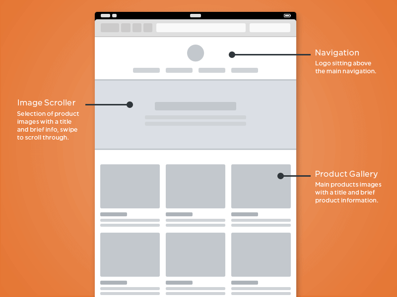

<h5 class="title"> A Web Design Process</h5>

Project Initiation
=============

A potential client has a problem they want to solve. Before the project starts, find out about budget etc, along with the following:

* How will solving this problem help our business?
* Why is our business capable of making this solution a success?
* What are the Unique Selling Points of the client's idea?
* What is the overall goal of the project?
* What are the moral implications of working with the client? Will we be able to sleep at night?
* Who from the client's side will be the one contact person with "the final word" during the project?
* What are the deadlines? Are there any milestones? 

<h5>References</h5>
<a href="http://www.elezea.com/2013/05/one-ux-deliverable/">Unique Selling Points and more</a>

Framing the problem
===================

Meet with the client, preferably in person, and interview them around the following questions.

### Questions for client
#### Marketing Overview
* What types of marketing are you currently involved in or practice on a regular basis?
* Do you have a tag line?
* What is your elevator pitch?
* Do you have a mission statement?

#### Marketing Goals and Objectives
* When it comes to marketing (in general), what are your biggest challenges?
* When it comes to obtaining qualified leads, what are your biggest challenges?
* When it comes to closing leads, what are your biggest challenges?
* Are there any short-term or long-term corporate goals that need to be considered in the website redesign?

#### Product and Service Overview
* How would you briefly define your product or service offering?
* Do certain products and/or services speak to different type of clients?

#### End Users
* Who is the end user? What do they know? How tech savvy are they? Do they use old versions of browsers?
* Can the end users be classified into clear “personas” with varying degrees of needs and selection criteria?
* Which user needs are we trying to address? For existing products, what are the shortcomings we need to fix?
* What are the 3 most important tasks for the end user?
* What customer insights do we have available to inform the solution (customer support, analytics, market research, user research, competitive analysis, etc.)?
* At the end of a project or sale or even website visit, how do you qualify it as a success?
* In which context will the service/app be used? How important is responsive design?

#### Competitive Overview
* List a few competitors that you’d consider benchmark companies?
* What differentiates your company and product from your competitors?
* What about these companies makes then stand apart from others?
* What elements of these companies and/or their online activity would you like to model after in your redesign?

#### Search Overview
* Based on what you know right now, what keywords or phrases would “you” use to search for your products and/or service offering?
* What search terms are your competitors targeting?
* Of the words you just listed, which ones would you like to target with the new website?
* Do you have existing content that can support these keywords or phrases?
* Does your existing website and content rank for these phrases?

#### Website Current State
* What does your website currently do well?
* What does your website currently do poorly?
* Are there any aspects of your website that you love?
* Are there any aspects of your website that you hate?
* Is there anything on the current website that needs to be removed entirely?
* Is there anything on the current website that must absolutely stay?

#### Website Future State
* What is the most important factor of your new website?
* What functional requirements are needed within the new website?
* What visual elements are needed within the new website?
* Are there any brand colors that should be used for the new website?
* What social media elements would you like integrated?
* Do you have a proposed sitemap prepared?
* Do you need a subscription option or other offer?
* Will you be blogging?
* Will you require responsive design (adapts automatically to mobile devices)?
* Is there anything that you would like to have included in the new website that you lack currently?

#### Project Constraints
* What is proposed date for kicking off your web design project?
* What is you desired date for going live?

#### Content to Assemble
* High resolution logo
* Content for pages
* Blog posts
* Literature or brochures
* Sales presentations
* Case studies
* Press releases
* Videos or podcasts
* Images
* Testimonials
* Articles
* Events
* Other marketing collateral
* Set up Dropbox or equivalent for quick sharing of files

### The Client and the designer
* The client should work closely with the designer and developer. Answer their questions quickly to prevent road blocks.
* Focus on problems, not solutions. If a problem is stated, the designer can suggest a solution. Everyone needs to know **why** something should change so always explain why something is bad.
* **Never ask a client what they think of the design**. Ask them instead how they believe their users will react to the design or whether it meets their business objectives.

### The framing of the problem
* Strip down number of tasks as much as possible to focus on a minimally viable product (MVP) 
* Summarize the task and see if client agrees.
* This product is like "..." but with a "..." Try finding similarities to other products but point to the Unique Selling Point.

<h5>References</h5>
<a href="http://www.web-savvy-marketing.com/2013/03/web-design-projects-50-questions/">50 Questions before a project</a>
<a href="http://alistapart.com/article/usable-yet-useless-why-every-business-needs-product-discovery">Product Discovery</a>
<a href="http://viljamis.com/blog/2012/responsive-workflow/">Responsive Workflow</a>
<a href="http://www.smashingmagazine.com/2011/05/06/how-to-get-sign-off-for-your-designs/
">The Client's Role</a>

Research & Learning
=============================

Getting on the same page as the client, learning about end users, understanding the context for the product, understanding why the product is important and how it should work.

### Product walkthrough
#### Preferable product walkthrough
* Have end users explain how they work to solve the problem at hand.
* Where are they when they use the tool(s)? At home? At work? On the go?

#### Second best product walkthrough
* Have client show the product, step by step how it's used.
* If possible, record the walkthrough on video.

#### Mapping
* What do different areas/parts of the existing design do? E.g. "Provide information", "Allow for entries" etc.
* Where in the system does the user **get information**? Where does the user **enter information**. i/o.
* Are there areas for interacting with settings and general site specific issues?
* How are these things reflected in the current layout?

### Journey Maps
* "The relationship that unfolds over time between an individual and a system."
* Grounded in research (interviews, ethnographic observation, contextual inquiry, surveys).
* Good for workshops with clients.
* **Content of map**: Original user story: Along the timeline, plot out how the system works today.
* **Content of map**: How it could be. Next to original story, plot out ideas for how it could be.
* **Content of map**: Questions a user might have at a certain point. “Can I trust this retailer?” or “When will my stuff arrive?”
* Examples of journey maps:

<h5>References</h5>
<a href="http://uxmag.com/articles/illustrating-the-big-picture">UXMag </a>
<a href="http://www.elezea.com/2013/05/one-ux-deliverable/">Unique Selling Points and more</a>
<a href="http://customerexperienceplanning.com/2012/04/11/customer-journey-mapping-part-i-the-basics/
">Journey Maps</a>

Concept work for UI
================

Start working on a concept level, finding metaphors, similarities to other interfaces and systems, move quickly between concepts, don't get stuck on one solution. **Explore, don't refine**.

### Brainstorming
#### Structure and basic rules
* Main purpose is to get as many ideas as possible. Not as good ideas as possible.
* **No criticizing of ideas** during the brainstorm. All ideas are valid no matter how crazy. Criticizing comes later.
* Type out 3 main questions that needs to be answered, e.g. "How can we allow for a good system overview considering we have data X, Y and Z that needs to be in it?". Ask yourself: "What problem do we need so solve?".
* No more than 4-5 people in a brainstorming group.
* Use post-it notes to prevent interrupting each other.
* Use thick markers on post-its so the text/sketches are seen from across the room.

#### During brainstorm
* If stuck on a question, jump to the next.

#### Categorizing after brainstorm session
* Try to see what overall categories have emerged, e.g. "Navigation", "CMS", 
* Cluster redundant or similar notes
* Take photos of post-its at the end of the brainstorm.

### Sketching
* Pen and paper: Diagrams or screenshots. Draw arrows and text showing what things are and which action leads to what.
* Take photos of sketches and email/post them to the team for feedback.

### Wireframes
* Black and white, maybe grayscale
* Make miniature wireframes for quick and holistic explorations that let you go through possible layout and style solutions.

### Card Sorting
* When you know which sections the system will have but need to find out how they should be hierarchically ordered and sorted.

### Usability Testing
* Recommended: Once a month with a group of three participants.
* Start earlier than you think makes sense, even if all you have are sketches or wireframes.

#### Recruiting
* Recruit loosely. It’s ideal to get participants who are similar to the intended users of the site, but it’s not a requirement.
* Recruit participants via [craigslist](http://www.craigslist.com) or a recruiting firm.
* Call the participants to make sure they are qualified. 
* A few days before the session, follow up with a reminder email.

#### Preparation of tests
* Come up with tasks for people to try, turn these into scenarios e.g. "Book an appointment online".
* You’ll determine the tasks/scenarios to test by figuring out what the most critical tasks on your site are, the ones that people should definitely be able to do well when using your site.

#### During the test
* The moderator presents the company, explains that the test is voluntary,  the site that will be tested, and what we’ll be doing during the test. 
* The moderator has the participant sign a release form. 
* The moderator asks the tester a few pre-test questions and records their answers.
* Use a tool such as [Silverback](http://silverbackapp.com/) to record the session.
* **The entire team working on the project** should try to watch the sessions in real time via screen sharing. 

#### After the test
* After the sessions, the moderator and observers will make a list of the 10 most important problems that the testing revealed. They will be prioritized and a plan made for how to fix them before the next round of usability testing.
* When fixing problems, always do the least you can do. Think about what the smallest thing you can do to fix the problem is and do that.

<h5>References</h5>
<a href="http://www.optimalworkshop.com/">Card Sorting Tools and More</a>
<a href="http://playbook.thoughtbot.com/understanding-design/usability-testing/">Usability Testing at thoughtbot</a>
<a href="http://www.amazon.com/Rocket-Surgery-Made-Easy-Do-It-Yourself/dp/0321657292">Steve Krug’s book Rocket Surgery Made Easy</a>
<a href="http://www.peachpit.com/promotions/promotion.aspx?promo=137602">Usability test example video</a>
<a href="http://insideintercom.io/wireframing-for-web-apps/">Wireframes</a>

Project Management
================

Use a tool like <a href="http://trello.com">Trello</a> or <a href="https://www.apptrajectory.com">Trajectory</a> to document stories on cards.

### Listing Ideas
* State the problem in the title of the card. State who has the problem.
* Post sketches. 
* Get client feedback on the card.

### Tasks
* Mark each story with the type of task it is (for developer? for designer? for client to answer?)
* Prioritize stories. This is an ongoing task for the client to make sure the most important things are implemented first.

### Potential topics/categories for todos
* Ideas
* Discussions
* On Hold
* Up Next
* Done
* Up for review
* Feature Creep (Items added after agreed set of todos)

<h5>References</h5>
<a href="http://trello.com">Trello</a>

General Style
============

Develop the general look and feeling for the style.

### Brand Manuals
* Does the brand/client/product have a brand style manual? How strict does it have to be followed?

### Come up with keywords that fit the product
* Describing the feeling the product should express
* e.g. Strong vs Delicate, Friendly vs Exclusive, Playful vs Serious, Quirky vs Strict, Modern vs Timeless, Simple vs Complex, Clean vs Active/Busy. 
* Take screenshots/photos of other sites/objects/products that express this according to you.
* Always get sign-off from client. Make sure **one** person from the client's side can have the final word to avoid conflicting messages down the road.

### Color swatches
* Select colors that correspond to the keywords
* Use something like [Color Scheme Designer](http://colorschemedesigner.com/).

### Style Tile or Element Collages
* Create a [Style Tile](http://styletil.es/) (template below) or an [Element Collage](http://danielmall.com/articles/rif-element-collages/) and communicate with clients.
* Show a range of elements rather than a full layout to save time. Client gets a feeling for the look and feel and style, not the details or the ixd. Prevents client from focusing on the wrong things.
* Everything will change so don't believe in there being a "final sketch" in FW/PS.

### Typography
* Find a typeface for body type that fits the keywords
* Use a tool such as [Modular Scale](modularscale.com) to set sizes of type and elements.

<h5>References</h5>
<a href="http://styletil.es/">Style Tiles</a>
<a href="http://danielmall.com/articles/rif-element-collages/">Element Collages</a>

Type Treatments
================

These are tried and tested styles and clichés for typography.

### Headings
* **Small headings** for indicating sub categories of articles. Can be used with stripes for color coding.

* Small heading **inside of a block**. Can be color coded. Also called "cameo".

* **Serif together with sans serif** to add contrast and life.

* Highlight importance with sections or **words in contrast color**.

* **Contrast bold letters with light letters**. Headlines etc.

### Paragraph Text
* **Drop caps** for traditional looking prose.

Graphic Styles
===================

These are tried and tested styles and clichés for graphic elements.

### Images and text on images
* Solid block with text on top of image for a rigid and serious layout

* **Dark layer** over a background image to turn it "monochrome" and to allow text on top of it.

* Blurry image in the back. Sharp graphics in the front.

* Duotone for images

* Gradient overlay for images to create depth, harmony (with other elements), unity (if image is too busy etc).

* Fade out parts of images to put focus on certain areas.

### Textures
* Overlay semitransparent image of texture

### Colors
* **Light vs dark** area contrasting.

* Semi-transparent color layer on top of black/white graphics.  

 

* Brand **color stripe** across screen (often on top) to anchor the page.

* Monochrome **vector outlines** on monochrome or gradient elements.

* **Monochrome background** and black and white image on top for focus and to make it look more stylized.

* **White room** for products to create spacious feeling. Fits well with type in the same area.

* **Handmade**, or hand drawn, elements add contrast and life to a layout.

### Boxes and layouts
* **Overlapping elements** can disrupt a too rigid layout.

* Contrast 2D elements with 3D elements.

### Details and effects
* Semi-transparent borders.

* Cut-through fat type so you see image in the background, through letter.

* Details and/or illustrations in monochrome and mono thick strokes.

* Overprint effect for visual disruption and retro look.

<h5>References</h5>
<a href="modularscale.com">Modular Scale</a>
<a href="http://colorschemedesigner.com/">Color Scheme Designer</a>

