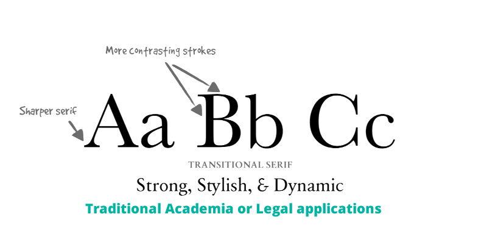
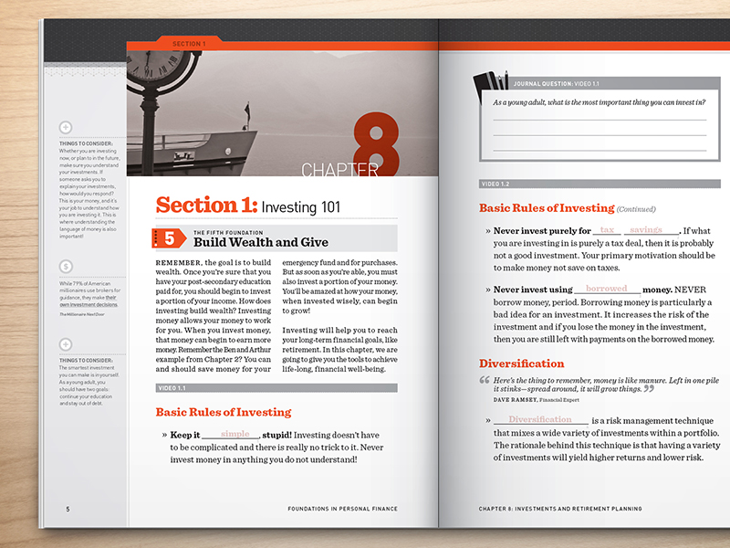

<h5 class="title">Type Treatments</h5>

General Type Treatments
================

These are tried and tested styles and clichés for typography.

## Serifs

* **Humanist** for journalism or historical applications

* **Transitional** for academia or legal applications 

* **Modern** for arts or cultural applications 

* **Slab** for marketing or promotional applications

## Sans Serifs
* **Humanist** for government, financial or educational applications 

* **Transitional** for technology or transportation applications 

* **Geometric** for science or architecture applications 

## Pairings
* Contrast, not conflict
* 

## Headings
* **Small headings** for indicating sub categories of articles. Can be used with stripes for color coding.

* Small heading **inside of a block**. Can be color coded. Also called "cameo".

* **Serif together with sans serif** to add contrast and life.

* Highlight importance with sections or **words in contrast color**.

* **Contrast bold letters with light letters**. Headlines etc.

* Multiple headings.

## Paragraph Text
* **Drop caps** for traditional looking prose.

## Statistics
* Large stats together with icons and explanations.

<h5>References</h5>
<a href="http://design.codeschool.com/">Code School</a>
<a href="http://www.creativebloq.com/typography/20-perfect-type-pairings-3132120">Type Pairings</a>

