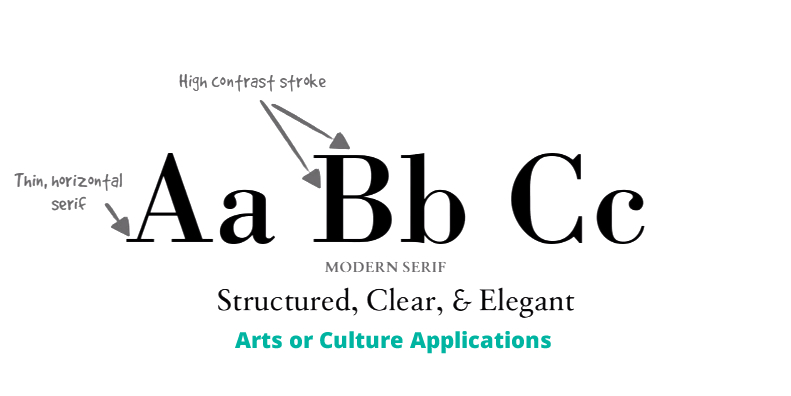
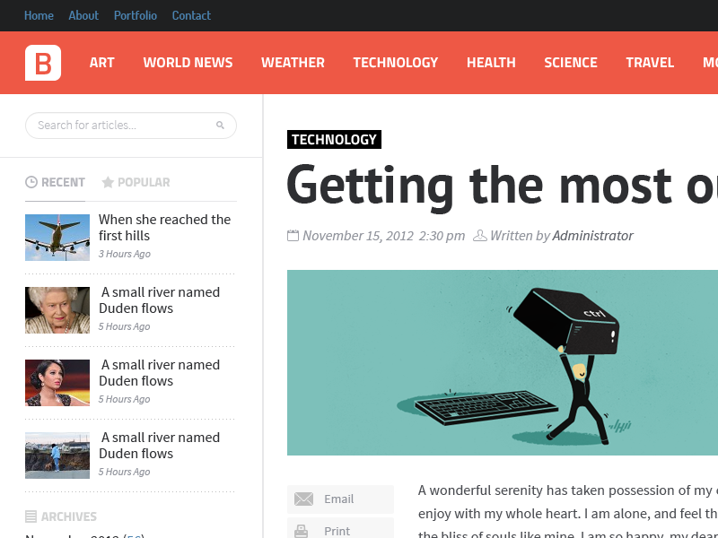
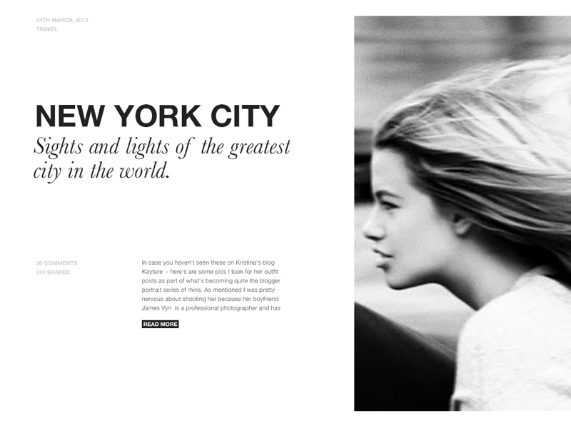
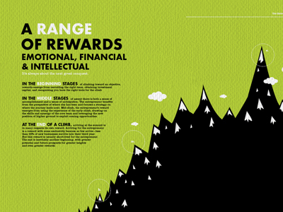
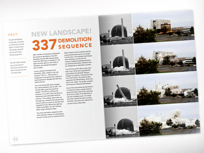
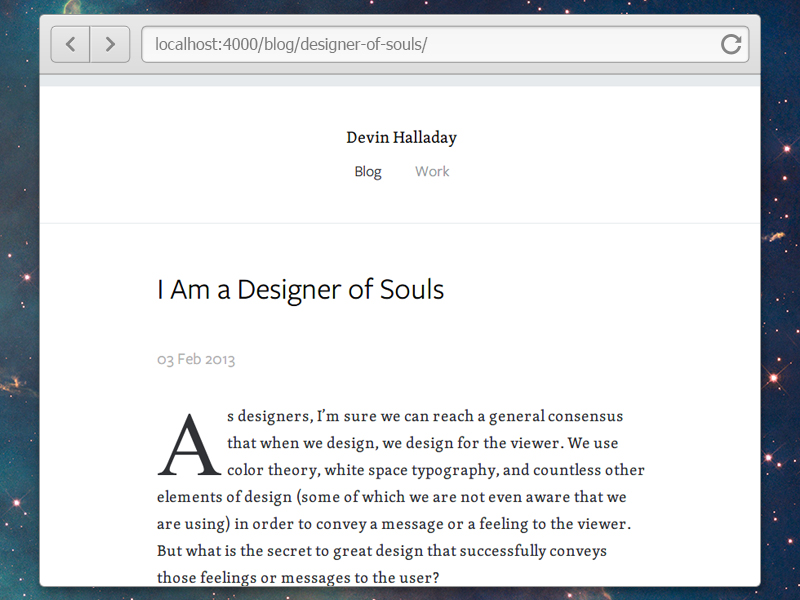

<h5 class="title type-treatments">Type Treatments</h5>

These are tried and tested styles and clichés for typography.

Serifs
======
### Humanist or Old Style
Dating back to the mid 1400s. Diagonal stress (the thinnest parts of the letters appear on the angled strokes, rather than the vertical or horizontal ones).
* Journalism 
* Historical applications

### Transitional 
Date back to the mid 1700s. The differences between thick and thin strokes are more pronounced than they are in old style serifs, but less so than in modern serifs.
* Academia
* Legal applications 

### Modern
Date back to the late 1700s. Pronounced contrast between thin and thick lines, and have have a vertical stress and minimal brackets. 
* Arts 
* Cultural 
* Modernism
* High Class

### Slab
Little to no contrast between thick and thin lines, and have thick, rectangular serifs, and sometimes have fixed widths. 
* Marketing
* Promotional

### Script
There are two basic classifications: **formal** and **casual**. Formal scripts are often reminiscent of the handwritten letterforms common in the 17th and 18th centuries. Casual scripts more closely resemble modern handwriting.

### Display
Reserved for headlines or other short copy that needs attention drawn to it.

Sans Serifs
===========
### Humanist
* Government
* Financial
* Educational 

### Transitional
* Technology 
* Transportation

### Geometric
These sans serifs are constructed of straight, monolinear lines and circular or square shapes. This can make them very cold and clinical, but also quite simple. The starkness of most geometric sans serifs makes for great headings, but they are usually less than ideal for long paragraphs.
* Science
* Architecture 
* Usually not ideal for body copy

https://typekit.com/lists/geometric-sans-serifs

http://www.noupe.com/design/a-crash-course-in-typography-the-basics-of-type.html
Classifications

Pairings
========
* Contrast, not conflict
* 

Headings
========
* **Small headings** for indicating sub categories of articles. Can be used with stripes for color coding.

* Small heading **inside of a block**. Can be color coded. Also called "cameo".

* **Serif together with sans serif** to add contrast and life.

* Highlight importance with sections or **words in contrast color**.

* **Contrast bold letters with light letters**. Headlines etc.

* Multiple headings.

Paragraph Text
==============
* **Drop caps** for traditional looking prose.

Statistics
==========
* Large stats together with icons and explanations.

<h5>References</h5>
<a href="http://design.codeschool.com/">Code School</a>
<a href="http://www.creativebloq.com/typography/20-perfect-type-pairings-3132120">Type Pairings</a>

